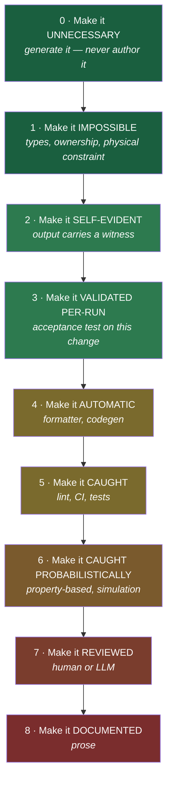
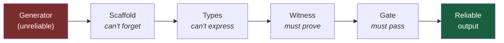

# Reliable Systems from Unreliable Generators

### What DNA, Voyager, Toyota, and the FORTRAN compiler know that your linter doesn't

---

> **The question:** an LLM writes code that breaks your conventions. You write a rule to catch it. It breaks a different one. You write another rule. Where does this end?
>
> **The short answer:** it doesn't — because you're answering at the wrong layer. Every field that has ever had to build something reliable on top of something unreliable solved it the same way, and none of them solved it by writing more rules.

---

## Table of contents

- [1. The experiment](#1-the-experiment)
- [2. The wrong answer, and why it feels right](#2-the-wrong-answer-and-why-it-feels-right)
- [3. The ladder](#3-the-ladder)
- [4. What other fields did](#4-what-other-fields-did)
  - [4.1 Biology: the most impressive error correction ever built](#41-biology-the-most-impressive-error-correction-ever-built)
  - [4.2 Physics and information theory](#42-physics-and-information-theory)
  - [4.3 Mathematics: checking is easier than finding](#43-mathematics-checking-is-easier-than-finding)
  - [4.4 Manufacturing: make the mistake physically impossible](#44-manufacturing-make-the-mistake-physically-impossible)
  - [4.5 Aviation: the field that got 12x safer](#45-aviation-the-field-that-got-12x-safer)
  - [4.6 Medicine: a five-line checklist](#46-medicine-a-five-line-checklist)
  - [4.7 Finance: a 500-year-old checksum](#47-finance-a-500-year-old-checksum)
  - [4.8 Civil engineering and surveying](#48-civil-engineering-and-surveying)
  - [4.9 Computing's own theory](#49-computings-own-theory)
- [5. The compiler precedent](#5-the-compiler-precedent)
- [6. What actually generalises](#6-what-actually-generalises)
- [7. Three things that don't work](#7-three-things-that-dont-work)
- [8. The craftsmanship argument](#8-the-craftsmanship-argument)
- [9. A playbook](#9-a-playbook)
- [10. Honest limits](#10-honest-limits)
- [Sources](#sources)

---

## 1. The experiment

I asked 100 independent agents to each write one feature for the same codebase. Same instructions, same conventions file — a 429-line `CLAUDE.md` that is genuinely good, specific, and full of correct advice. Then I measured what came back: 100 files, 26,038 lines.

**70 of 100 files violated at least one documented convention.**

| Rule violated | Occurrences | Files |
|---|---:|---:|
| `Any` in annotations | 85 | 21 |
| raw `dict` type | 85 | 43 |
| naive `datetime` (drops timezone) | 55 | 21 |
| team-scoped session bypassed | 22 | 22 |
| separator banners | 8 | 2 |
| silent exception fallback | 5 | 5 |
| eager settings import | 3 | 3 |

Two things in this table matter more than the rest.

**First: the most-violated rule is a prohibition.** *"Never `Any`, never raw `dict`"* is stated plainly, early, in a file every agent read. It was broken 170 times. Meanwhile "don't use em-dashes" — equally a prohibition, equally documented — was broken 8 times. The difference isn't emphasis or clarity. It's that a **formatter already enforces the second one** and nothing enforces the first.

**Second: the sorted list of violations is exactly the list of rules with no mechanical enforcement.** Not approximately. Exactly. Every rule that had a gate behind it was obeyed; every rule that had only prose behind it was broken in proportion to how often the wrong thing was the convenient thing.

That's not a story about model quality. That's a story about where a constraint lives.

---

## 2. The wrong answer, and why it feels right

The natural response is to write a rule. Something detected the violation — so encode the detection, catch it next time.

The codebase in question has done this thoroughly and well: a hand-rolled review tool with **105 custom rules**, mined from over 100 historical pull requests, including rules that cite the specific PR where each bug first appeared. It's better than what most teams have.

Here's the problem. I counted where every constraint in that repo actually lives:

```
Layer                          Count
─────────────────────────────────────────────
Make it impossible                 0
Make it automatic                  4     (formatter, codegen)
Make it caught — BLOCKING         11     (syntax check, format, tests)
Make it caught — ADVISORY        ~107     (105 review rules + complexity)
Make it documented            4,000+ lines of prose
```

The CI lint gate is `flake8 --select=E9,F63,F7,F82` — four families covering syntax errors and undefined names. The richer check that computes complexity and line length right below it carries `--exit-zero`, so it reports and **gates nothing**.

So: every new rule lands in the advisory tier. The advisory tier cannot stop anything. The failure recurs. You write another rule.

**That's the whole loop, and it's structural rather than a discipline problem.** The pyramid is upside down — nearly everything at the bottom, nothing at the top.

There's supporting evidence for why prose specifically fails. On the [RealInstruct benchmark](https://arxiv.org/abs/2410.06458), GPT-4 fails at least one constraint on **over 21% of multi-constraint instructions**. A 429-line conventions file carries well over a hundred distinct instructions. And Google learned the organisational version of this the hard way: they [tried FindBugs in 2007](https://cacm.acm.org/research/lessons-from-building-static-analysis-tools-at-google/) and engineers ignored it *despite a management mandate*, because the false-positive rate produced alert fatigue.

Advisory findings get ignored. By humans and by models.

---

## 3. The ladder

The usual framing is four rungs: **impossible > automatic > caught > documented**. Having gone through what other fields actually do, that's too coarse. The real ladder has nine, and two of the most important are usually missing from software discussions entirely.



Stages **2 (self-evident)** and **3 (validated per-run)** are the ones software talks about least and other fields lean on most. Hold onto them — nearly every example below is one of those two.

---

## 4. What other fields did

### 4.1 Biology: the most impressive error correction ever built

This is the best example in existence, and it's four billion years old.

DNA polymerase — the enzyme that copies your genome — is **not reliable**. Its raw error rate is about **1 in 100,000** bases. If that were the final number, every human cell division would introduce ~60,000 errors and multicellular life would be impossible.

The actual error rate of DNA replication is about **1 in 10,000,000,000**.

That's a **100,000-fold improvement over the generator**, and here's how it's achieved:

| Stage | Mechanism | Error rate after |
|---|---|---:|
| 1. Base selection | polymerase active-site geometry | 10⁻⁵ |
| 2. Proofreading | 3'→5' exonuclease backs up and excises | 10⁻⁷ |
| 3. Mismatch repair | scans the new strand, cuts, resynthesises | 10⁻¹⁰ |

**The stages multiply.** 10⁻⁵ × 10⁻² × 10⁻³ = 10⁻¹⁰. Three independent mediocre checks compose into one extraordinary guarantee.

And the theory behind it is precisely relevant. [John Hopfield (1974) and Jacques Ninio (1975)](https://en.wikipedia.org/wiki/Kinetic_proofreading) explained how biology beats the accuracy that equilibrium thermodynamics permits: **kinetic proofreading**. You add a second, energy-consuming verification step where the *correct* substrate and the *incorrect* one are given a second chance to dissociate. The cell **spends ATP to buy accuracy**.

Three lessons transfer directly:

1. **Nobody tried to make the polymerase perfect.** It's still 10⁻⁵ after four billion years of optimisation pressure. The reliability lives in the checking layers, not the generator.
2. **Verification is a separate stage that runs after generation** and looks only at the output.
3. **Accuracy costs energy.** There is no free reliability. Proofreading is thermodynamically expensive, and the cell pays because the alternative is worse.

If you want your agent output to be 100× better than your agent, stop tuning the agent.

### 4.2 Physics and information theory

**Hamming (1950).** Richard Hamming was at Bell Labs with a relay computer that suffered [2–3 relay failures a day](https://www.recurse.com/blog/44-paper-of-the-week-error-detecting-and-error-correcting-codes) across ~8,900 relays. He'd start a computation on Friday and find it destroyed on Monday. Rather than demand better relays, he invented codes that **locate and repair** the error from redundancy already in the message.

**Reed–Solomon (1960) → Voyager.** On a channel with a raw error rate around 10⁻⁴, Reed–Solomon corrects up to **16 corrupted bytes in every 223-byte block**, delivering effective error rates near 10⁻¹². The same family of codes is why a scratched CD still plays and a torn QR code still scans. The physical medium got *worse*; the delivered data got *perfect*.

**Shannon (1948)** proved the general result: below channel capacity, arbitrarily reliable communication over an unreliable channel is possible. Not "nearly reliable" — arbitrarily.

**The quantum threshold theorem** is the sharpest modern version, and the most encouraging. Qubits are appallingly unreliable. The theorem ([Knill–Laflamme–Zurek, Aharonov–Ben-Or](https://pmc.ncbi.nlm.nih.gov/articles/PMC11864966/)) says: **if the physical error rate is below a threshold — roughly 1% for surface codes — then arbitrarily reliable quantum computation is achievable**, with logical error falling exponentially as you add redundancy.

Above the threshold, no amount of redundancy helps; error correction introduces errors faster than it removes them. Below it, you can buy any reliability you're willing to pay for. In December 2024, [Google's Willow chip demonstrated below-threshold operation](https://www.quantamagazine.org/quantum-computers-cross-critical-error-threshold-20241209/) — three decades of theory confirmed in hardware.

**Why this matters for AI-generated code:** there is a *threshold*, not a gradient. The useful question is not "how good is the model" but "is the model's error rate below the level at which my checking layer removes more errors than it introduces?" Below it, more checking compounds. Above it, more checking is theatre.

There's a directly analogous [2025 finding for LLM self-correction](https://arxiv.org/html/2604.22273v2): refinement loops only improve accuracy when the model's error-*introduction* rate stays beneath a small threshold. Above it, iterating makes output worse. Same shape of result, same practical warning.

### 4.3 Mathematics: checking is easier than finding

Mathematics has the cleanest version of the core asymmetry: **finding a proof is hard; checking one is easy.** That gap is what makes the whole enterprise work — a referee doesn't need to be as clever as the author.

Formalised, this is the P vs NP intuition, and it becomes spectacular in the [PCP theorem](https://www.cs.umd.edu/~gasarch/TOPICS/pcp/AS.pdf) (Arora–Safra, 1992): every NP proof can be rewritten so a verifier reads only a **constant number of randomly chosen bits** and still catches a false proof with high probability.

The practical arm is the proof assistant. The [Four Colour Theorem](https://en.wikipedia.org/wiki/Four_color_theorem) (Appel & Haken, 1976) was the first major theorem proved by a computation no human could check — and it was *controversial for exactly the reason your reviewers distrust generated code*. Nobody could read it. The resolution wasn't a human reading it; it was **Georges Gonthier's 2005 formalisation in Coq**, replacing "trust the authors" with "check the proof mechanically." Same story for the Kepler conjecture and the Flyspeck project.

**The generator became untrustworthy and unreadable. The response was a machine checker, not a demand for readable proofs.**

### 4.4 Manufacturing: make the mistake physically impossible

**Poka-yoke** — Shigeo Shingo at Toyota, 1960s. Originally *baka-yoke*, "fool-proofing," renamed after a worker objected to being called a fool. That renaming is the philosophy: **stop blaming the operator, change the system**.

Shingo's origin case: workers assembling a switch sometimes forgot to insert a spring. The fix wasn't training or a poster. He had them first place the required springs in a small dish. **An empty dish at the end means you did it right; a leftover spring is an unmissable signal that you didn't.** The error becomes visible without inspection.

The crucial distinction is **warning** poka-yoke (tells you afterwards) versus **control** poka-yoke (makes it physically impossible):

| Warning | Control |
|---|---|
| a buzzer if the seatbelt is unfastened | a diesel nozzle too wide for a petrol filler neck |
| a lint rule that reports `Any` | a type checker that refuses to compile |
| a review comment | a SIM card that only fits one way |
| your 105 advisory rules | a microwave that won't run with the door open |

**Your advisory rules are warning poka-yoke. Every one of them.**

**Jidoka and the andon cord.** Toyota gives any worker the authority to **stop the entire production line** when they see a defect. That sounds insane until you do the arithmetic: a defect passed downstream accumulates labour and parts, and eventually needs a recall. Stopping is cheaper than continuing. In your terms — a failing gate on a PR is cheaper than the same bug found by a reviewer, which is cheaper than production.

**Deming's Point 3** is the sentence to pin above your CI config:

> *"Cease dependence on inspection to achieve quality. Eliminate the need for massive inspection by building quality into the product in the first place."*

He wrote that about factories in the 1980s. A 105-rule review tool is **massive inspection**. Deming's whole argument is that inspection is what you do when you've failed to control the process — it's expensive, it's late, and it never catches everything.

Walter Shewhart's original 1924 insight underlies it: distinguish **common-cause** variation (the process is noisy — fix the process) from **special-cause** variation (something specific broke — fix that thing). Writing a new rule for each violation treats common-cause variation as if it were special-cause. Our 100 files show 70% failure. That's not 70 special causes. That's a process producing what it was set up to produce.

### 4.5 Aviation: the field that got 12x safer

Between 1970 and 2019 the fatal accident rate fell **twelvefold**, from 6.35 to 0.51 per million flights. Nobody made pilots more reliable. Five distinct mechanisms did it, and each maps onto a rung of the ladder.

**1. Checklists (stage 3 — per-run validation).** After the 1935 Boeing Model 299 crash, aviation adopted the pre-flight checklist. Note what a checklist is *not*: it isn't training, and it isn't a rule. It's a **per-flight verification that specific state holds right now**. The pilot already knows to set the flaps. The checklist confirms it happened *this time*.

**2. Crew Resource Management (stage 7, done properly).** At Tenerife in 1977, 583 people died partly because a flight engineer who suspected the runway wasn't clear didn't press the point with a senior captain. United 173 in 1978 ran out of fuel while the crew debugged a landing gear light, with two officers unable to make the captain hear them. The response was CRM: **explicit training in contradicting authority**. Review only works if the reviewer can actually stop the thing.

**3. Blameless reporting (the feedback loop).** NASA's [Aviation Safety Reporting System](https://en.wikipedia.org/wiki/Aviation_Safety_Reporting_System) (1976) lets any aviation professional report an incident confidentially, and filing is treated as evidence of a constructive attitude rather than grounds for penalty. It's administered by NASA, which has **no enforcement authority** — deliberately. The system learns because reporting is safe.

**4. Dissimilar redundancy.** Critical flight computers use **different hardware running independently written software**. Not three copies — three *different* implementations. Aviation engineers understood something we'll come back to: identical redundancy doesn't protect against a design flaw, because all copies share it.

**5. The Swiss cheese model** (James Reason). Every layer has holes. Accidents happen when holes in successive layers line up. You don't get safety from one perfect barrier; you get it from several imperfect ones whose holes are in different places.

That last point is the answer to "but my linter has false negatives." Of course it does. So does every other layer. **The layers are supposed to be independently imperfect** — that's the design, exactly as in DNA's three-stage cascade.

### 4.6 Medicine: a five-line checklist

Peter Pronovost's central-line study is the most striking result in this entire piece.

Central venous catheter infections were killing patients. Pronovost wrote down five steps: wash hands, clean skin with chlorhexidine, drape the patient, wear sterile kit, apply a sterile dressing. Every doctor already knew all five. He added one thing: **nurses were empowered to stop the procedure if a step was skipped.**

Infection rates across Michigan ICUs went from 2.7 per 1,000 to **zero within three months**, held for 18 months, with an estimated **1,500 lives and $100 million saved**.

Nothing new was learned. Nothing was invented. The knowledge already existed and was already documented — it just wasn't *enforced at the point of action*. That's the entire intervention.

The [WHO Surgical Safety Checklist](https://en.wikipedia.org/wiki/Surgical_safety_checklist) (Haynes et al., NEJM 2009) showed mortality falling from 1.5% to 0.8% across eight countries. **Honest caveat, because it matters:** this one has had failed replications — a large Spanish study found no difference. The mechanism appears to depend heavily on implementation fidelity and team buy-in. A checklist that gets rubber-stamped is not a checklist.

Which is precisely why the *advisory* version of your 105 rules doesn't work, and the gated version would.

### 4.7 Finance: a 500-year-old checksum

Double-entry bookkeeping, codified by Luca Pacioli in 1494, is the oldest self-verifying system in continuous use — and it is essentially a **witness scheme**.

Every transaction is recorded twice, as a debit and a matching credit. The identity `Assets = Liabilities + Equity` must hold at all times. Sum both columns: if they don't match, **something is wrong and you know it immediately, without an auditor, without re-deriving anything.**

Three properties worth naming:

- **Errors are detected by the structure**, not by a person looking hard.
- **Checking is cheap** — add two columns — while producing correct books is expensive.
- **It doesn't tell you *what* is wrong.** It tells you *that* something is, which is enough to look.

That's the shape you want from generated code: a cheap structural check whose failure is unambiguous.

*(I should note: this parallel between double-entry and test-driven development is my own framing. I tried to verify a common claim that Robert C. Martin makes this analogy explicitly and could not confirm it in his writing — what I did confirm is that he uses a [Semmelweis handwashing analogy](https://blog.cleancoder.com/uncle-bob/2014/05/02/ProfessionalismAndTDD.html) instead. More on him in §8.)*

### 4.8 Civil engineering and surveying

**Proof load testing.** Before a crane or a bridge enters service, it is loaded **beyond its design maximum** and observed. Not analysed — *loaded*. The structure demonstrates its own adequacy. A calculation says it should hold; the proof load shows that this specific fabricated instance, with its actual welds and material, does.

That's the difference between reviewing generated code and running it against a test that would fail if it were wrong.

**Closing the traverse.** A surveyor measuring a plot walks the boundary, measuring bearings and distances, and returns to the starting point. The measurements should say they're back where they began. **Any discrepancy is the accumulated error, made visible for free.**

There is no way to hide a bad measurement from a traverse closure. The check is intrinsic to the method, costs one extra measurement, and requires no second surveyor. Like the trial balance, it's a witness the process emits about itself.

**Factor of safety.** Buildings are typically built to twice their design load, pressure vessels to 3.5–4×. This is explicit, quantified humility: *we know our materials vary, our analysis is approximate, and our loads are estimates.* Engineering assumes its own unreliability and budgets for it, rather than assuming correctness and being surprised.

### 4.9 Computing's own theory

**von Neumann (1952/56), *Probabilistic Logics and the Synthesis of Reliable Organisms from Unreliable Components*.** The founding result: unreliable components, triplicated and majority-voted, give reliable computation — provided failures are **independent** and the voter is trustworthy.

**Knight & Leveson (1986) — the most important result here, and the least known.**

Avizienis had proposed *N-version programming*: have N teams independently implement the same spec, run all N, vote. If the versions are independent, failures multiply out.

Knight and Leveson tested it. **27 independently written programs, one million test inputs.** Failures were **correlated far beyond chance**.

The cause wasn't bad programmers. It was that **ambiguity lives in the specification**, and independent implementers reading the same ambiguous spec make the *same* misinterpretation.

This is the single most relevant result in the literature for anyone using AI to write code, and it directly refutes the most popular proposed fix:

> **Running three LLMs and voting does not work.** Your conventions file is the ambiguous specification. Three agents reading it produce correlated errors. Voting ratifies them.

My 100-file experiment is a live demonstration: a hundred independent agents, one ambiguous 429-line spec, and **70% failed on the same handful of rules**. Majority voting would have concluded that `Dict[str, Any]` is correct — it had 43 votes.

**Randell (1975), recovery blocks.** The alternative that survives. Don't vote between implementations — apply an **acceptance test to the output**. Run the primary; if the output passes the test, accept it; if not, try an alternate. The test must be cheaper than recomputation (verifying a list is sorted is O(n); sorting is O(n log n)).

**Blum & Kannan (1989), program checkers**, and **certifying algorithms** (Mehlhorn, McConnell et al.). The strongest form. Don't just check the output — have the program **emit a witness** alongside its answer that makes correctness cheap to confirm. A graph algorithm claiming a graph is bipartite returns the 2-colouring. You don't re-run the algorithm; you check the colouring.

**Saltzer, Reed & Clark (1984), the end-to-end argument.** The check belongs at the endpoint, not in the unreliable middle. No amount of link-level reliability removes the need for the endpoints to verify — so put the authoritative check there.

---

## 5. The compiler precedent

Everything above has a direct precedent inside software, and it's the closest analogy available: **in 1957 the compiler was the unreliable generator.**

Programmers rejected compiled output as slow and unreadable, and they were right to. Assembly experts objected on performance grounds and on control grounds — *if I don't write it myself, how do I know what it does?* Read that objection again; it is verbatim the objection to AI-generated code.

Four responses followed. All four are on the table for us.

**1 — Make the output good enough that the objection dies.** Backus knew FORTRAN would be rejected if it lost to hand assembly, so his team built the first optimising compiler. It worked, which is why resistance collapsed rather than being argued down. This is the "wait for better models" position, and historically it *did* eventually win — hand assembly stopped being the default in the 1990s.

**2 — Prove the generator correct, once.** McCarthy & Painter proved a compiler correct for arithmetic expressions in 1967. That lineage runs to Xavier Leroy's **CompCert**, ~90% verified in Coq, ACM Software System Award 2021. **This route is closed to us**: it needs a formal source semantics, and a conventions document isn't one.

**3 — Validate each run instead of the generator** (Pnueli, translation validation, 1998). Don't prove the compiler; prove *this compilation*. Dramatically cheaper, and it survives an untrustworthy generator.

**4 — Make the output carry its own proof** (Necula & Lee, proof-carrying code, 1997). The producer ships code *plus* a machine-checkable certificate. Trust relocates to a small proof-checker.

And then the decisive empirical fact. In 2011, [Yang et al. built Csmith](https://users.cs.utah.edu/~regehr/papers/pldi11-preprint.pdf), a random C program generator, and pointed it at production compilers. They found **325 previously-unknown bugs**, including 79 in GCC and 202 in LLVM. Every compiler tested silently generated wrong code from valid input.

That's after **fifty years** of the most scrutinised, most tested software humanity has written.

> **The generator never became reliable. The ecosystem around it became reliable.**

That is the answer to the question this post opened with, and it was settled decades ago.

One caveat worth keeping: Csmith found *no* wrong-code bugs in CompCert's verified core, after six CPU-years of trying. It did find bugs in CompCert's *unverified* parts. Verification works — it just only covers what it covers.

---

## 6. What actually generalises

Nine fields, one shape. Six principles hold everywhere:

### 1. Nobody fixes the generator

DNA polymerase is still 10⁻⁵ after four billion years. Qubits are still noisy. GCC still has bugs after fifty years. Pilots still make mistakes. **In every single case, reliability was built around the unreliable component rather than inside it.** Waiting for a model that doesn't need checking is the one strategy with no historical precedent.

### 2. Verification is cheaper than generation — exploit the gap

Sorting is O(n log n); checking sortedness is O(n). Finding a proof is hard; checking one is easy. Producing correct books is laborious; adding two columns isn't. Walking a survey boundary is a day's work; confirming the loop closes is arithmetic.

**Wherever this asymmetry exists, put your effort on the cheap side.** It's the most reliably profitable move available.

### 3. Make the producer emit a witness

Double-entry's trial balance. The surveyor's closure. Certifying algorithms' certificate. Proof-carrying code's proof. Shingo's leftover spring.

In each case the producer emits something *extra* that makes correctness checkable without redoing the work. **This is the mechanism software uses least and should use most.**

### 4. Errors multiply across independent stages

DNA: 10⁻⁵ × 10⁻² × 10⁻³ = 10⁻¹⁰. Swiss cheese: holes must align. Defence in depth: three layers at 10⁻³ give 10⁻⁹.

You do not need a perfect check. **You need several independently-imperfect ones.** Three 90% checks with uncorrelated blind spots beat one 99% check.

### 5. Independence is the load-bearing assumption — and it's usually false

Every result above depends on it. von Neumann assumed it. Knight & Leveson demolished it for software. Aviation engineers knew it well enough to insist on *dissimilar* hardware. TMR fails on common-mode failures.

**When you add a layer, ask what it shares with the existing ones.** Two LLM reviewers reading the same conventions file are not independent. A linter and a type checker largely are.

### 6. There is a threshold, and the check must be better than the noise

Below ~1% physical error, quantum error correction compounds; above it, correction adds errors faster than it removes them. The same shape appears in LLM self-correction research: refinement helps only below a low error-introduction rate.

A reviewer worse than the generator makes things worse. **Check that your checker is above threshold.**

---

## 7. Three things that don't work

Worth stating plainly, because each is popular.

**Voting between generated implementations.** Knight & Leveson, 1986. Correlated failures via shared spec ambiguity. My 100 files reproduce it. Don't build "ask three models and take the majority."

**Inspection as a quality strategy.** Deming's Point 3. Inspection is what you do when you've failed to control the process — expensive, late, and never complete. A 105-rule advisory review tool is massive inspection.

**More prose.** Compliance degrades as instruction count rises (>21% constraint failure for GPT-4 on multi-constraint instructions). Prohibitions decay faster than positive constructions. Your conventions file is competing for attention with the task itself, and the task usually wins.

---

## 8. The craftsmanship argument

There's a serious counter-position: the answer is **discipline**, not mechanism. Robert C. Martin is its best-known advocate, and he shouldn't be waved away.

His argument, applied here, is that TDD is the discipline that makes generated code safe — **the tests are the specification**, so it stops mattering who or what wrote the implementation. You can regenerate, refactor, or replace the code freely, because the tests hold the meaning. When code becomes nearly free to produce, the tests are the only thing left that carries intent.

Notably, [he reaches for a medical analogy](https://blog.cleancoder.com/uncle-bob/2014/05/02/ProfessionalismAndTDD.html) — Semmelweis and handwashing in 1847 — which is a *poka-yoke* story rather than a craft story. Doctors knew about germs; mortality fell when the washing became mandatory practice rather than good advice. That's Pronovost's finding a century and a half early, and it points at enforcement more than at virtue.

**Where I think he's right:** tests are the acceptance test of §4.9. A failing test is a machine-checkable witness that doesn't care about the producer's reliability. That's Randell's recovery block in the form every team already has installed. Generated code makes this *more* important, not less — precisely because the producer is untrustworthy and the volume is high.

**Where the evidence is weaker than the advocacy:** the case for test-*first* specifically is mixed. The Microsoft/IBM studies (Nagappan et al.) reported 40–90% defect-density reductions, but from teams who *chose* to adopt TDD — a serious self-selection problem. Later meta-analyses found the evidence "limited and inconsistent," and the recurring finding is that **having tests matters much more than the order in which you write them**. Martin's own [response to a null result](http://blog.cleancoder.com/uncle-bob/2016/11/10/TDD-Doesnt-work.html) is that the study inadvertently made both groups do short cycles — a fair methodological point, and also an unfalsifiable one.

**Where the position runs out:** Nancy Leveson's critique is the serious one. Individual discipline works for teams of 5–50 building web applications. It does not scale to safety-critical systems, which is why aviation and nuclear use **structural** constraints rather than professional virtue. You cannot ask an LLM to be disciplined. You can only put it in a system where indiscipline doesn't ship.

Casey Muratori's separate critique — that Clean Code advice is largely unmeasured, optimising readability over measurable behaviour — lands too, and is a useful reminder that this whole essay's recommendations should themselves be measured.

**My read:** discipline and mechanism aren't competitors. Discipline is how you decide *what* to enforce. Mechanism is what makes the enforcement survive contact with a tired human at 6pm, or a language model with 40,000 tokens of context. TDD is the right instinct; the missing half is making the test unavoidable rather than admirable.

---

## 9. A playbook

Ordered by leverage.

**Step 0 — Count your layers.** Before changing anything, count how many constraints sit at each rung. If the answer is "0 impossible, 11 blocking, 107 advisory, 4,000 lines of prose," you know what to do. This takes an afternoon and it's the highest-value thing in this list.

**Step 1 — Promote what you already have.** The cheapest wins are always constraints you're already computing and then discarding. That `--exit-zero` on your complexity check. The `continue-on-error` on the lint step. Adopting an off-the-shelf linter for rules you hand-rolled. **No new rules — just make the existing ones binding.**

**Step 2 — Make one thing impossible.** Pick the violation that scares you most — for me it was ABAC bypass, a security property defended by one sentence in a prose file — and move it into the type system. If the only session type a CRUD manager accepts is the team-scoped one, passing the wrong thing stops being a review comment and becomes a compile error.

**Step 3 — Demand a witness.** This is the underused one. Require every generated change to ship something cheap to check and expensive to fake:

- a migration ships an upgrade → downgrade → upgrade round-trip that reproduces the schema
- a bug fix ships the test that fails without it
- a team-scoped endpoint ships a test proving a foreign tenant is rejected

That's the trial balance, the traverse closure, and the certifying algorithm, in the form your CI can run.

**Step 4 — Scaffold, don't instruct.** Generate module skeletons rather than documenting them. This kills an entire class — the "you did A but forgot B" registration bugs — because generators don't forget.

The obvious objection is that scaffolded code is editable, so it's a default rather than a guarantee. True, and worth being precise about: **its real value is converting omissions into commissions.** "Agent forgot to register the ABAC resource" is invisible — no diff, nothing to review. "Agent deleted the registration the scaffold wrote" is a red line in a diff. Same end state; completely different detectability. And the compiler world's answer to editability is **regeneration plus a drift check**, not immutability.

**Step 5 — Stop the line.** Whatever survives to CI must block. An advisory gate is a warning poka-yoke, and Google's FindBugs experience is what happens to those.

**Step 6 — Keep the layers independent.** When adding a check, ask what it shares with the existing ones. Diversity of *mechanism* — a type checker, a test, a structural check — beats more of the same.



---

## 10. Honest limits

Where this argument is weaker than it sounds:

**The analogy to compilers is imperfect.** A compiler has a formal source semantics, so "correct" is a theorem. A conventions document is not a semantics; there's nothing to prove. That's exactly why the practical answer here is acceptance tests and witnesses (stages 2–3) rather than verification (stage 1) — but it means the strongest historical precedent doesn't fully transfer.

**Over-constraining has real costs.** The evidence on AI-assisted development shows a "productivity–reliability paradox": far more PRs merged, proportionally more review time, flat delivery metrics. Gate everything and the queue becomes your bottleneck. Enforce correctness and security properties. Don't enforce taste.

**Acceptance tests can be gamed and deleted.** A witness is only as good as its unforgeability. A test the agent wrote to pass its own code is not independent evidence — that's Knight & Leveson's correlation problem wearing a new hat.

**Some things genuinely can't be mechanised.** "Build small reusable functions", "comments explain why not what" — these need judgement. Prose is the *right* home for them. The argument isn't that documentation is worthless; it's that documentation is doing work it can't do when it's carrying rules a machine should own. Strip the enforceable rules out and the remaining prose gets followed better, because it's no longer competing with a hundred rules a linter should have taken.

**Formal methods mostly failed to be adopted.** Hoare logic, design by contract, dependent types — decades of elegant theory, minimal industrial uptake. What actually got adopted was cheap and integrated: type systems (universal), Rust's borrow checker (Android reports memory-safety bugs falling from ~75% to ~24% of vulnerabilities), Facebook's Infer (80% fix rate because it comments on the diff). **Integration beats power.** A weak check in the workflow beats a strong check beside it.

---

## Sources

**Reliability theory**
- [von Neumann, *Probabilistic Logics and the Synthesis of Reliable Organisms from Unreliable Components* (1952/56)](https://archive.org/details/vonNeumann_Prob_Logics_Rel_Org_Unrel_Comp_Caltech_1952)
- [Knight & Leveson, *An Experimental Evaluation of the Assumption of Independence in Multiversion Programming* (1986)](http://sunnyday.mit.edu/papers/nver-tse.pdf)
- [Randell, *System Structure for Software Fault Tolerance* (1975)](http://homepages.cs.ncl.ac.uk/brian.randell/PapersInProceedings/341.pdf)
- [Blum & Kannan, *Designing Programs That Check Their Work* (1989/95)](https://dl.acm.org/doi/10.1145/200836.200880)
- [Mehlhorn & McConnell et al., *Certifying Algorithms*](https://people.mpi-inf.mpg.de/~mehlhorn/ftp/CertifyingAlgs.pdf)
- [Saltzer, Reed & Clark, *End-to-End Arguments in System Design* (1984)](https://web.mit.edu/saltzer/www/publications/endtoend/endtoend.pdf)
- [Lamport, Shostak & Pease, *The Byzantine Generals Problem* (1982)](https://lamport.azurewebsites.net/pubs/byz.pdf)
- [Arora & Safra, *Probabilistic Checking of Proofs* (1992)](https://www.cs.umd.edu/~gasarch/TOPICS/pcp/AS.pdf)

**Compilers**
- [Backus, *The History of FORTRAN I, II and III*](https://softwarepreservation.computerhistory.org/FORTRAN/paper/p165-backus.pdf)
- [McCarthy & Painter, *Correctness of a Compiler for Arithmetic Expressions* (1967)](http://www-formal.stanford.edu/jmc/mcpain.pdf)
- [Leroy, *Formal Verification of a Realistic Compiler* (CompCert)](https://xavierleroy.org/publi/compcert-CACM.pdf)
- [Yang et al., *Finding and Understanding Bugs in C Compilers* (PLDI 2011)](https://users.cs.utah.edu/~regehr/papers/pldi11-preprint.pdf)
- [Pnueli, Siegel & Singerman, *Translation Validation* (TACAS 1998)](https://dblp.org/rec/conf/tacas/PnueliSS98.html)
- [Necula & Lee, *Proof-Carrying Code* (POPL 1997)](https://dl.acm.org/doi/10.1145/263699.263712)
- [Thompson, *Reflections on Trusting Trust* (1984)](https://www.cs.cmu.edu/~rdriley/487/papers/Thompson_1984_ReflectionsonTrustingTrust.pdf)

**Physics, information theory, biology**
- [Hamming, *Error Detecting and Error Correcting Codes* (1950)](https://onlinelibrary.wiley.com/doi/10.1002/j.1538-7305.1950.tb00463.x)
- [Quantum error correction below threshold (Google Willow, 2024)](https://pmc.ncbi.nlm.nih.gov/articles/PMC11864966/) · [Quanta coverage](https://www.quantamagazine.org/quantum-computers-cross-critical-error-threshold-20241209/)
- [Kinetic proofreading (Hopfield 1974, Ninio 1975)](https://en.wikipedia.org/wiki/Kinetic_proofreading) · [Speed, dissipation and error in kinetic proofreading, PNAS](https://www.pnas.org/doi/10.1073/pnas.1119911109)
- [DNA replication fidelity](https://academic.oup.com/nar/article/48/16/9124/5881278)
- [Four Colour Theorem and its Coq formalisation](https://en.wikipedia.org/wiki/Four_color_theorem)

**Industrial, aviation, medical**
- [Poka-yoke (Shingo)](https://en.wikipedia.org/wiki/Poka-yoke) · [Jidoka](https://en.wikipedia.org/wiki/Jidoka)
- [Shewhart control charts](https://en.wikipedia.org/wiki/Control_chart) · [W. Edwards Deming](https://en.wikipedia.org/wiki/W._Edwards_Deming)
- [Tenerife airport disaster](https://en.wikipedia.org/wiki/Tenerife_airport_disaster) · [United 173](https://en.wikipedia.org/wiki/United_Airlines_Flight_173) · [Crew Resource Management](https://en.wikipedia.org/wiki/Crew_resource_management)
- [Aviation Safety Reporting System](https://en.wikipedia.org/wiki/Aviation_Safety_Reporting_System) · [Swiss cheese model](https://en.wikipedia.org/wiki/Swiss_cheese_model)
- [Peter Pronovost, central line checklist](https://en.wikipedia.org/wiki/Peter_Pronovost) · [WHO Surgical Safety Checklist](https://en.wikipedia.org/wiki/Surgical_safety_checklist)
- [Double-entry bookkeeping](https://en.wikipedia.org/wiki/Double-entry_bookkeeping) · [Factor of safety](https://en.wikipedia.org/wiki/Factor_of_safety)

**LLMs and software engineering practice**
- [DeCRIM / RealInstruct — multi-constraint instruction following](https://arxiv.org/abs/2410.06458)
- [Constitutional Spec-Driven Development](https://arxiv.org/abs/2602.02584)
- [Sadowski et al., *Lessons from Building Static Analysis Tools at Google* (CACM 2018)](https://cacm.acm.org/research/lessons-from-building-static-analysis-tools-at-google/)
- [Distefano et al., *Scaling Static Analyses at Facebook* (CACM 2019)](https://dl.acm.org/doi/10.1145/3338112)
- [Newcombe et al., *How Amazon Web Services Uses Formal Methods* (CACM 2015)](https://dl.acm.org/doi/10.1145/2699417)
- [Alexis King, *Parse, Don't Validate*](https://lexi-lambda.github.io/blog/2019/11/05/parse-don-t-validate/)
- [Robert C. Martin, *Professionalism and TDD*](https://blog.cleancoder.com/uncle-bob/2014/05/02/ProfessionalismAndTDD.html) · [*TDD Doesn't Work*](http://blog.cleancoder.com/uncle-bob/2016/11/10/TDD-Doesnt-work.html)

---

*The 100-file experiment described in §1 was run against a real production codebase with a real conventions document. Figures are as measured. Where a claim comes from a single study or a contested replication, I've said so inline.*
